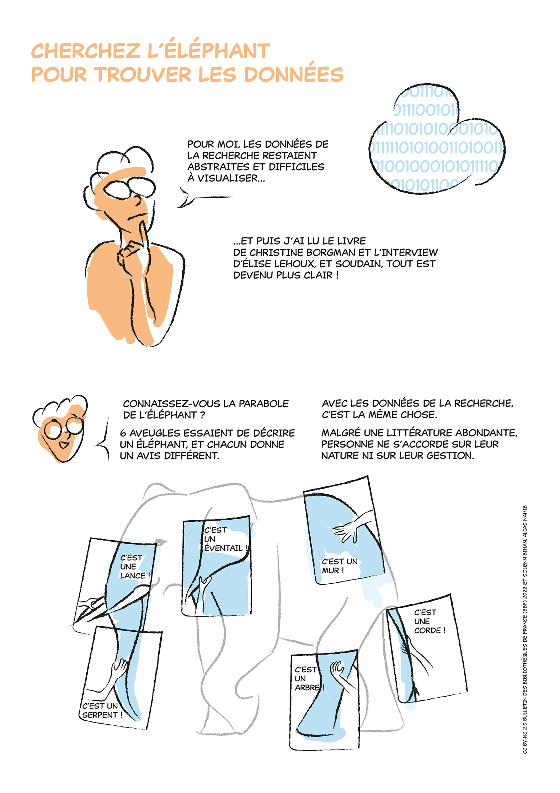

```{r setup, include=FALSE}
knitr::opts_chunk$set(echo = TRUE)
```

------------------------------------------------------------------------

# Définition des données de la recherche

Il existe de nombreuses définitions des données de la recherche.

La définition de l'OCDE (Organisation de coopération et de développement économiques) est la plus communément retenue :

> **Les données de la recherche sont définies comme des enregistrements factuels (chiffres, textes, images et sons), qui sont utilisés comme sources principales pour la recherche scientifique et sont généralement reconnus par la communauté scientifique comme nécessaires pour valider les résultats de recherche.**
>
> OCDE, « Principes et lignes directrices de l'OCDE pour l'accès aux données de la recherche financée sur fonds publics », Paris, 2007

A titre d'exemple, on peut également citer la définition issue de l'ANDS - Australian national data service (traduction Inist-CNRS) :

> Le terme de données de la recherche désigne les données sous forme de faits, d'observations, d'images, de résultats de programmes informatiques, d'enregistrements, de mesures ou d'expériences sur lesquels un argument, une théorie, un test ou une hypothèse, ou un autre produit de la recherche est basé. Les données peuvent être numériques, descriptives, visuelles ou tactiles. Elles peuvent être brutes, nettoyées ou traitées, et peuvent être conservées dans tout format ou support.
>
> ANDS, « What Is Research Data », 2017. <https://www.ands.org.au/__data/assets/pdf_file/0006/731823/Whatis-research-data.pdf>

------------------------------------------------------------------------

# **Diversité des données de la recherche**

Selon le projet, les données de la recherche peuvent être :

-   **produites :** ce sont les données créées, élaborées, générées lors d'activités de recherche (observations, mesures...)

-   **collectées** : ce sont des données déjà existantes (corpus, archives...) qui sont utilisées pour le projet. Les données utilisées peuvent avoir été recueillies initialement dans un autre contexte que celui de la recherche mais elles sont utilisées comme données de recherche dans le cadre du projet.

-   **produites et collectées**

Les données de recherche peuvent être de différentes natures et de tous types, contenues dans divers supports, selon leur contexte de création (capture ou production), leur exploitation, leur analyse et les traitements qu'elles subissent (voir ci-dessous)

------------------------------------------------------------------------

# **CParabole de l'éléphant**




BIHAN, Solenn, 2022. Cherchez l'éléphant pour trouver les données : traduction graphique à partir de l'interview de Christine Borgman. *BBF* 12 janvier 2022. Disponible à l'adresse : <https://bbf.enssib.fr/consulter/bbf-2021-00-0000-065>
