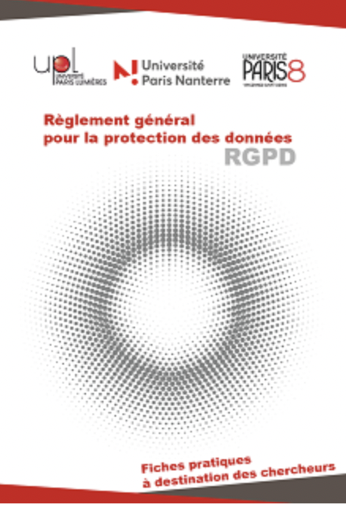
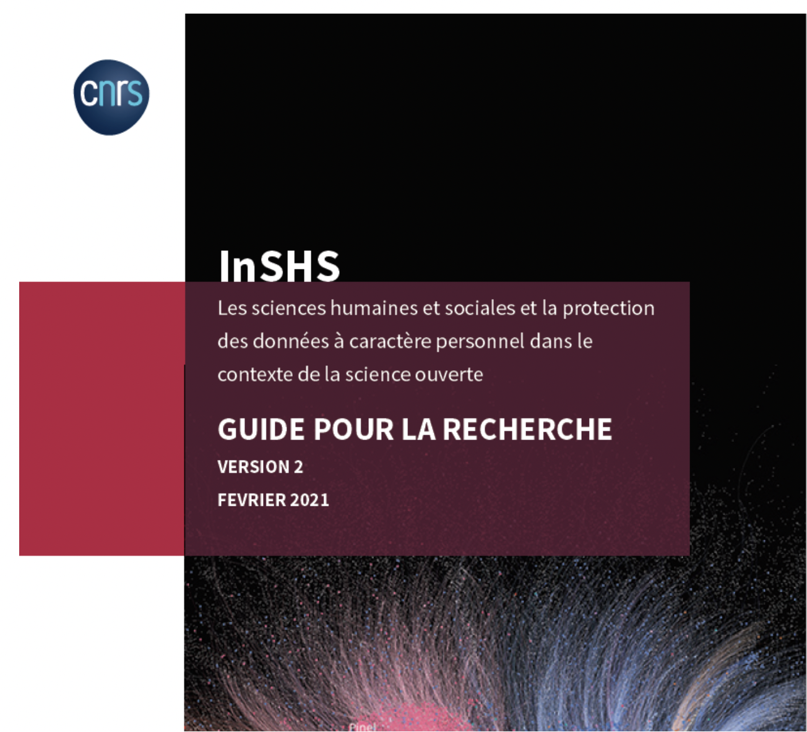

```{r setup, include=FALSE}
knitr::opts_chunk$set(echo = TRUE)
```

------------------------------------------------------------------------

Afin de vous aider à définir les règles de collecte, traitement et stockage de vos données pendant votre projet, voici deux guides RGPD qui pourront vous être utiles :

------------------------------------------------------------------------

### [Guide RGPD 2019](https://recherche.parisnanterre.fr/accueil/rgpd-fiches-pratiques-rgpd-recherche) - Université Paris Nanterre

<center>

{width="30%"}

</center>

Depuis le 25 mai dernier, le **Règlement Général pour la Protection des Données (RGPD)** s'applique aux établissements d'enseignement supérieur et de recherche. Il impacte le traitement des données personnelles au sein des projets de recherche.\
\
**Les établissements de la ComUE** ont réuni leurs compétences pour proposer un ensemble de fiches pratiques sur l'application du RGPD destinées aux chercheurs. Elles sont accessibles à tous sans connaissances juridiques.

**SOMMAIRE :**

-   Qui est propriétaire des données ?

-   Est-ce que je manipule des données personnelles ?

-   Les données de mon projet sont-elles sensibles ?

-   Quelles sont les modalités de collecte des données et leurs implications ?

-   Que faire pour respecter les droits des personnes ?

-   Quelles formalités accomplir et quel est le rôle du délégué à la protection des données (DPD ou DPO) ?

-   Est-ce que je peux/dois anonymiser les données ?

-   Quels réflexes pour la sécurisation des données ? (Protection contre le vol et chiffrement, stockage...)

-   Les données peuvent-elles voyager au-delà des frontières ?

-   Comment procéder pour l'archivage des données ?

-   Qui est responsable des traitements en cas de projet de recherche collaboratif ?

-   Quels sont les risques encourus pour moi, mon projet, mon institution ?

\
**Réalisation des fiches pratiques** : Catherine **Delplanque**, Nawale **Lamrini**, Fabrice **Leclère**, Lionel **Maurel**\
**Avec le concours de** : Isabelle **Autran**, Nabil **Belkouch**, Jose-Manuel **Coelho**, Claire **Hanen,** Julie **Nordin**\
**Edition** : **Direction de la recherche et des études doctorales** - **Université Paris Nanterre**

------------------------------------------------------------------------

### [Guide InSHS 2021](https://recherche.parisnanterre.fr/accueil/rgpd-fiches-pratiques-rgpd-recherche) - CNRS

Les sciences humaines et sociales et la protection des données à caractère personnel dans le contexte de la science ouverte :

<center>

{width="50%"}

</center>

**SOMMAIRE** :

**Chapitre 1 - Les principales définitions et leur application pour les recherches en sciences humaines et sociales**

-   Les données à caractère personnel

-   Les acteurs et leur rôle

-   Le périmètre de la règlementation : la territorialité

-   Le traitement de données

-   Les principes relatifs au traitement de données

-   L'analyse d'impact sur la vie privée

-   Les droits des personnes

**Chapitre 2 : Les projets de recherche, le cycle de vie des données et la protection des données personnelles**

-   La création de la donnée

-   Les catégories de données

-   Les types de données personnelles

-   Le fondement du traitement associé à la collecte des données personnelle

-   La finalité

-   La proportionnalité

-   Le stockage des données

-   L'exploitation des données

-   L'archivage des données

-   Le partage des données dans la relation partenariale

-   La diffusion des données, la publication

-   Le réemploi des données

**La version 2 du Guide RGPD InSHS a été conçue par** :

**Fabrice Boudjaaba**, directeur adjoint scientifique à l'InSHS du CNRS

**Gaëlle Bujan**, Déléguée à la protection des données du CNRS

**Béatrice Collignon**, directrice de l'unité Passages

**Christine Hadrossek**, chargée des données de la recherche à la Direction des Données Ouvertes de la Recherche du CNRS

**Emilie Masson**, responsable juridique, service protection des données du CNRS

**Lionel Maurel**, directeur adjoint scientifique à l'InSHS du CNRS

**Clément Oliver**, responsable du pôle affaires juridiques et partenariats à l'InSHS du CNRS

**Serge Pinto**, directeur adjoint du laboratoire Parole et Langage

**Muriel Roger**, Professeure, Centre d'Economie de la Sorbonne, Université Paris1 Panthéon Sorbonne ; chargée du département « Méthodes et statistiques publiques » de la TGIR PROGEDO

**Paola Tubaro**, directrice de recherche au Laboratoire Interdisciplinaire des Sciences du Numérique
