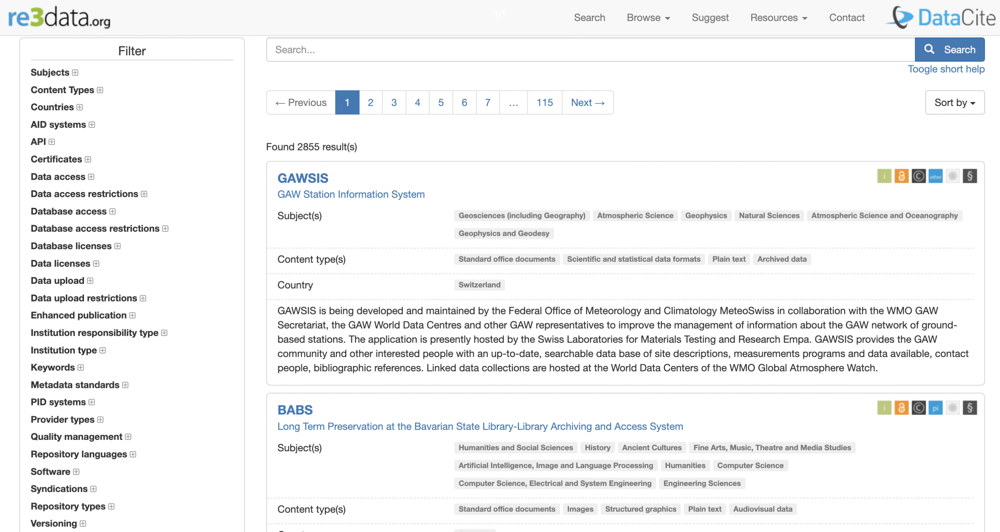
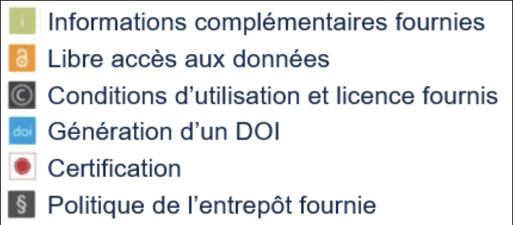
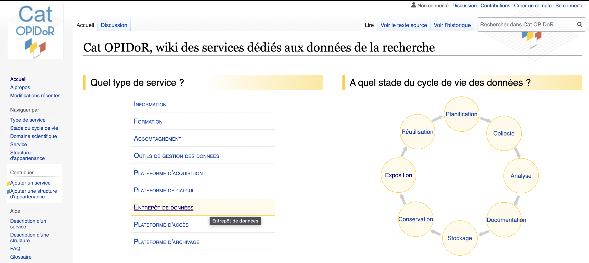
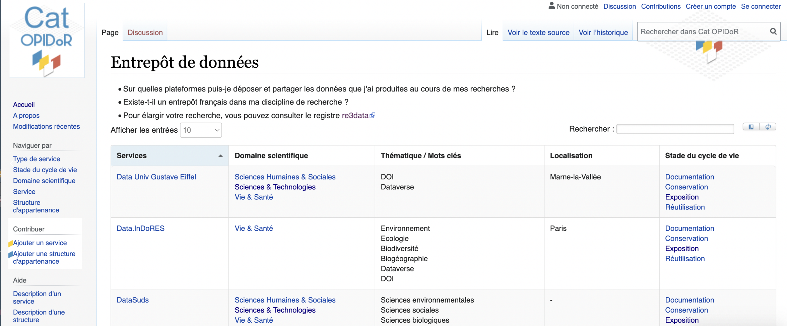

```{r setup, include=FALSE}
knitr::opts_chunk$set(echo = TRUE)
```

------------------------------------------------------------------------

## Recherche d'un entrepôt dans un annuaire - Re3data et Cat OPIDoR

**Re3data**

La recherche s'effectue grâce à des filtres sur [re3data](https://www.re3data.org). La liste des résultats apparait sous forme de brèves fiches descriptives présentant, pour chaque entrepôt, le sujet, le type de contenu, le pays, un petit résumé et des icônes symbolisant les critères auxquels répond l'entrepôt.



Les critères sont les suivants :

{width="10.8cm" height="5cm"}

------------------------------------------------------------------------

**Cat OPIDoR**

Pour trouver un entrepôt de données français, vous pouvez aussi utiliser l'outil [Cat OPIDoR](https://cat.opidor.fr/index.php/Cat_OPIDoR,_wiki_des_services_d%C3%A9di%C3%A9s_aux_donn%C3%A9es_de_la_recherche) : **Cat**alogue pour une **O**ptimisation du **P**artage et de l'**I**nteropérabilité des **Do**nnées de la **R**echerche.

Proposé sous forme d'un wiki, cet **outil collaboratif**, **gratuit** et ouvert à tous permet de **repérer** et ajouter des services utiles dans le cadre d'un projet de recherche.



Cat OPIDoR recense et décrit les **services français** dédiés aux données scientifiques et présente, par domaine scientifique : des sites d'information, de formation, des outils de gestion, des plateformes... pour accompagner les chercheurs sur l'ensemble des étapes clés de la gestion, collecte, stockage, conservation et ouverture des données.



------------------------------------------------------------------------

**Astuce : vous pouvez éventuellement trouver un entrepôt de données à votre convenance en effectuant une recherche sur le sujet que vous traitez via** [**Google Dataset Search**](https://datasetsearch.research.google.com) **ou** [**OpenAIRE Explore**](https://explore.openaire.eu)**. Ces moteurs de recherche sont conçus pour chercher directement des jeux de données.**

------------------------------------------------------------------------

**Crédits :**
Réseau URFIST - Inist-CNRS : [PARCOURS INTERACTIF SUR LA GESTION DES DONNÉES DE LA RECHERCHE](https://doranum.fr/enjeux-benefices/parcours-interactif-sur-la-gestion-des-donnees-de-la-recherche/)
