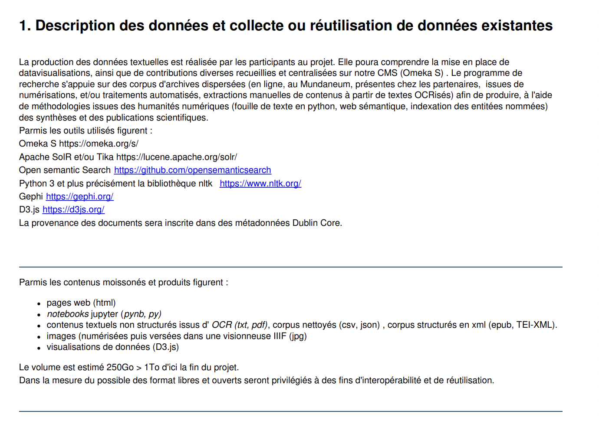
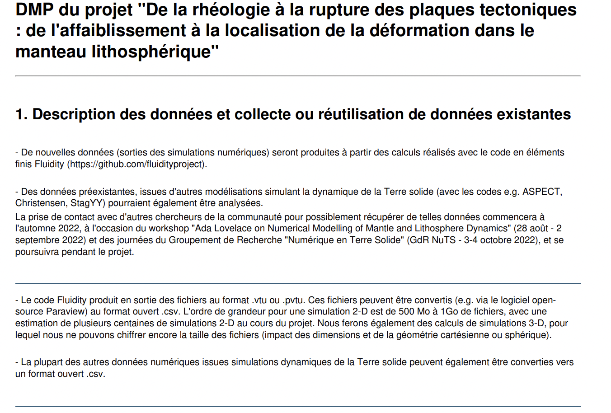

```{r setup, include=FALSE}
knitr::opts_chunk$set(echo = TRUE)
```

------------------------------------------------------------------------

### Exemple de PGD projet HyperOtlet :



<small>*DMP Public projet ["PGD HyperOtlet"](https://dmp.opidor.fr/plans/4205/export.pdf?export%5Bquestion_headings%5D=true) - section 1 modèle ANR*</small>

------------------------------------------------------------------------

### Exemple PGD projet : 



<small>*DMP Public projet ["De la rhéologie à la rupture des plaques tectoniques: de l'affaiblissement à la localisation de la déformation dans lemanteau lithosphérique"](https://dmp.opidor.fr/plans/13156/export.pdf?export%5Bquestion_headings%5D=true) - section 1 modèle ANR*</small>

------------------------------------------------------------------------

Merci aux contributeurs des PGD publics sur DMP OPIDoR d'avoir partagé leur PGD librement.
