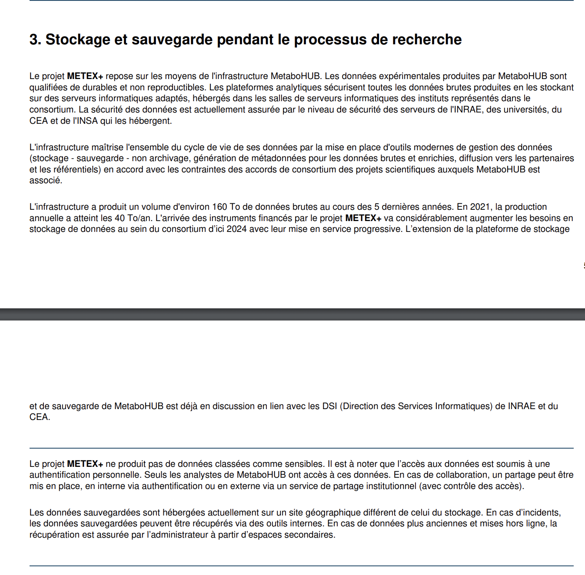

```{r setup, include=FALSE}
knitr::opts_chunk$set(echo = TRUE)
```

### Exemple PGD projet EQUIPEX MetaboHUB-METEX+ **:**



*DMP Public projet [EQUIPEX MetaboHUB-METEX+](https://dmp.opidor.fr/plans/13271/export.pdf?export%5Bquestion_headings%5D=true) - section 3a et b modèle ANR*

------------------------------------------------------------------------

Merci aux contributeurs des PGD publics sur DMP OPIDoR d'avoir partagé leur PGD librement.
