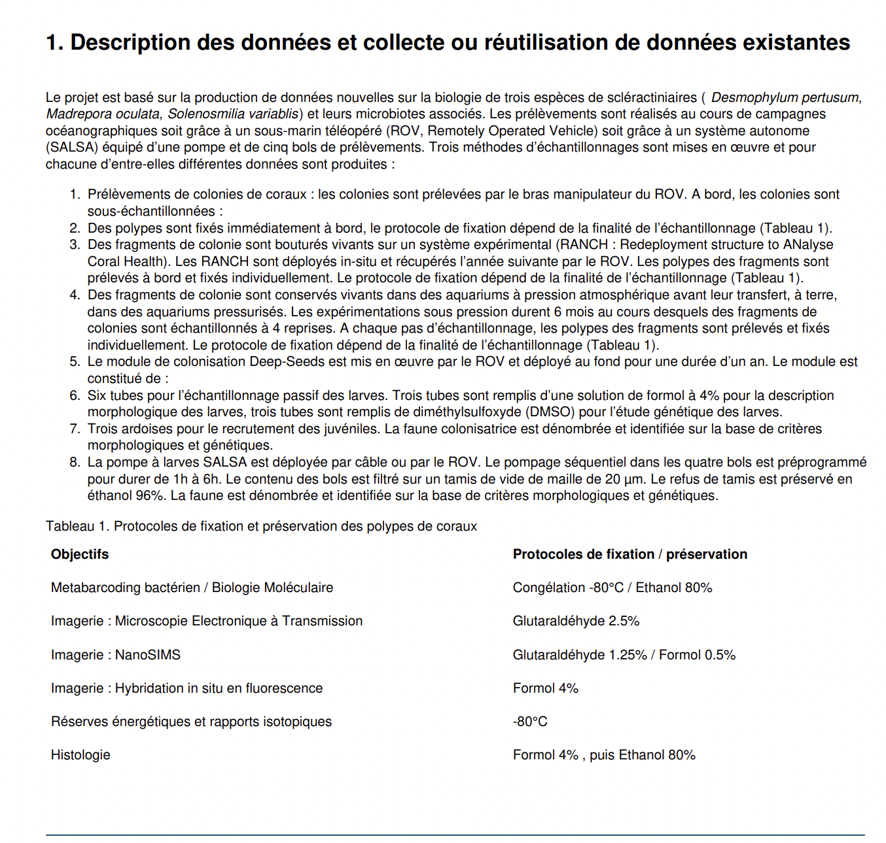

```{r setup, include=FALSE}
knitr::opts_chunk$set(echo = TRUE)
```

### Exemple PGD  projet "ARDECO" : 



*DMP Public projet [ARDECO](https://dmp.opidor.fr/plans/8349/export.pdf?export%5Bquestion_headings%5D=true) - section 1a modèle ANR*

------------------------------------------------------------------------

Merci aux contributeurs des PGD publics sur DMP OPIDoR d'avoir partagé leur PGD librement.
