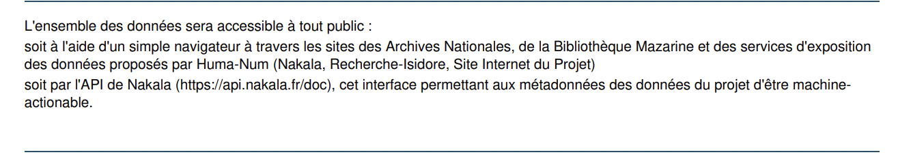
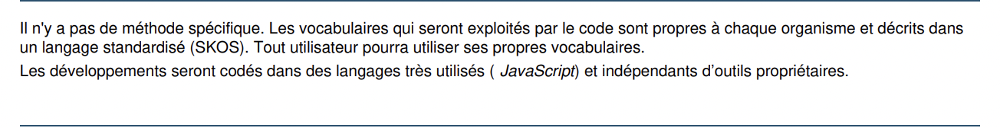

```{r setup, include=FALSE}
knitr::opts_chunk$set(echo = TRUE)
```

------------------------------------------------------------------------

### Exemple PGD projet E-NdP :



*DMP Public projet [E-NdP](https://dmp.opidor.fr/plans/10339/export.pdf?export%5Bquestion_headings%5D=true)- section 5c modèle ANR*

------------------------------------------------------------------------

### Exemple PGD projet Bridge Research through Interoperable Data Governance and Environments :



*DMP Public projet [Bridge](https://dmp.opidor.fr/plans/5954/export.pdf?export%5Bquestion_headings%5D=true) - section 5c modèle ANR*

------------------------------------------------------------------------

Merci aux contributeurs des PGD publics sur DMP OPIDoR d'avoir partagé leur PGD librement.
